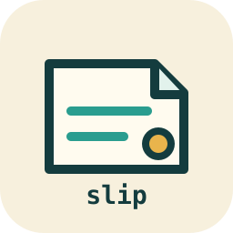
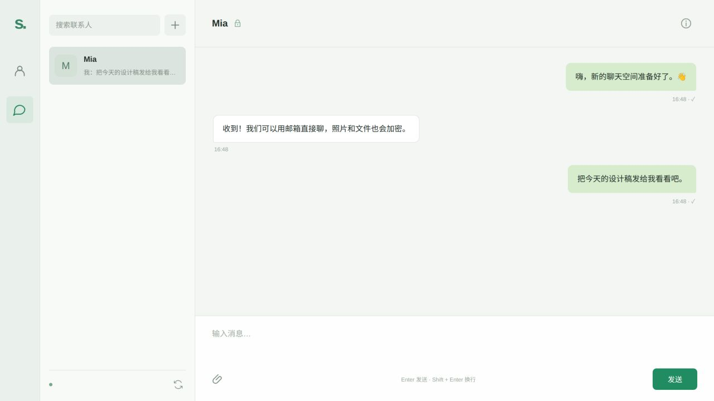
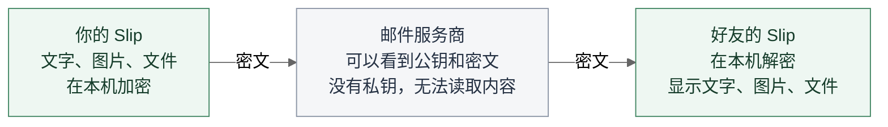

<p align="center">
  
</p>
<h1 align="center">Slip</h1>
<p align="center">让邮箱成为聊天工具，让对话留在自己的设备上。</p>
<p align="center">
  <a href="https://github.com/dingguanglei/Slip/releases/latest">下载桌面应用</a> ·
  <a href="docs/DESKTOP.md">使用指南</a> ·
  <a href="SECURITY.md">安全说明</a> ·
  <a href="https://github.com/dingguanglei/Slip/issues">反馈问题</a>
</p>
<p align="center">
  <a href="https://github.com/dingguanglei/Slip/actions/workflows/ci.yml"></a>
  <a href="https://github.com/dingguanglei/Slip/releases"></a>
  <a href="LICENSE"></a>
</p>

Slip 是一款开源桌面聊天应用。它使用你已有的邮箱传递消息，将文字、图片和文件加密后通过 SMTP 发送，再由对方的 Slip 通过 IMAP 接收。双方使用各自的邮箱即可交流，不需要注册 Slip 账号，也不需要部署聊天服务器。

**Slip 的聊天文字、图片和文件采用端到端加密。邮件服务商负责传输密文，无法读取聊天内容；加密、解密和聊天记录保存在双方设备上。**



<sub>实际应用界面，使用虚构联系人展示。安装包不包含这些账号或聊天记录。</sub>

## 为什么使用 Slip

- **沿用自己的邮箱**：支持 QQ、Gmail、iCloud 等预设邮箱，朋友可以使用不同的邮件服务商。
- **正文与附件端到端加密**：先交换公钥，再发送内容；未取得公钥或对方密钥发生变化时暂停发送，没有明文降级。
- **记录留在本机**：文字、图片和文件按账号独立保存，退出登录后仍保留，下次登录继续查看。
- **收到并保存后清理**：验证消息并可靠写入本地后，精准删除对应的服务器聊天邮件；删除失败会重试，普通邮件不参与清理。
- **熟悉的聊天界面**：浅色三栏布局、图标导航、联系人搜索、未读提醒、图片预览和文件下载。点击加号即可发送公钥交换申请。
- **独立桌面应用**：Electron 界面内置 Rust 通信引擎，支持 macOS、Windows 和 Ubuntu，无需安装开发工具。

## 下载

| 系统 | 架构 | 安装包 |
| --- | --- | --- |
| macOS 13+ | Apple Silicon / ARM64 | [下载 ZIP](https://github.com/dingguanglei/Slip/releases/download/v0.2.0/Slip-0.2.0-macos-arm64.zip) |
| Windows 10 / 11 | x86-64 | [下载 ZIP](https://github.com/dingguanglei/Slip/releases/download/v0.2.0/Slip-0.2.0-windows-x64.zip) |
| Ubuntu 22.04+ | ARM64 | [下载 DEB](https://github.com/dingguanglei/Slip/releases/download/v0.2.0/Slip-0.2.0-ubuntu-arm64.deb) |
| Ubuntu 22.04+ | x86-64 / AMD64 | [下载 DEB](https://github.com/dingguanglei/Slip/releases/download/v0.2.0/Slip-0.2.0-ubuntu-amd64.deb) |

macOS 解压后打开 `Slip.app`；Windows 完整解压后运行 `Slip.exe`；Ubuntu 安装 DEB 后从应用菜单启动。发行页提供 SHA-256 校验值。

当前安装包未发行签名或公证，系统可能显示安全提示。平台运行验证范围见 [发行说明](https://github.com/dingguanglei/Slip/releases/tag/v0.2.0)。

## 开始一段对话

1. 在邮箱服务中开启 IMAP / SMTP，生成应用密码或授权码。
2. 打开 Slip，输入邮箱地址和授权码。首次启动不会带入任何账号，每次重启都需要重新登录。
3. 点击联系人列表旁的 **＋**，输入好友邮箱。对方也需要使用 Slip 并交换公钥。
4. 通过其他可信渠道核对双方指纹。建立加密连接后，即可发送文字、图片和文件。

聊天标题旁的锁表示已建立加密连接；回形针用于添加附件。个人信息页管理当前邮箱和本机身份。单次最多发送 8 个附件，总计 12 MB。

详细步骤及常见问题见 [桌面使用指南](docs/DESKTOP.md)。

## 端到端加密如何保护对话

消息在发送方设备上加密，到接收方设备上才解密。**公钥可以公开：邮件服务商即使拿到双方公钥和传输的密文，没有对应私钥，也无法解密聊天内容。** 私钥由 Slip 在本机生成，不通过邮件发送。



**需要防范的是首次交换公钥时的中间人攻击。** 如果攻击者主动把双方的公钥替换成自己的，并分别与双方建立加密连接，就可能解密并转发消息。这与“拿到你们真实的公钥就能解密”不同。通过当面、电话等其他可信渠道核对双方指纹，可以发现这种替换；核对不一致时不要继续通信。

Slip 首次记录联系人公钥（TOFU），后续发现密钥变化时会警告并暂停发送，直到用户重新信任；未取得公钥时也不会把聊天内容降级为明文发送。公钥交换本身不包含聊天正文或附件。

## 隐私与边界

端到端加密保护内容，不隐藏所有通信信息。邮件服务商仍能看到收发地址、时间、大致大小和 Slip 协议标记。服务器清理无法消除服务商内部备份，但备份中的加密聊天仍是密文，不会因此变成可读内容。

中间人攻击不是唯一的泄露途径：设备被控制、私钥被窃取，或对方主动分享内容，也会影响保密性。当前没有前向保密，身份私钥泄露可能使已被保存的历史密文遭到解密。本地数据库和附件为明文，应保护设备与备份。

Slip 不承诺匿名通信或“零痕迹”。发送成功表示邮件服务器已接收，不等于对方已经阅读。

了解完整的 [安全模型](SECURITY.md) 与 [协议](docs/PROTOCOL.md)，再决定是否适合自己的使用场景。

## 从源码运行

需要 Rust stable、Node.js 22+ 和 npm。Linux 还需图形运行库，见 [构建说明](docs/BUILDING.md)。

```bash
git clone https://github.com/dingguanglei/Slip.git
cd Slip
cargo build --bin slip-web
cd desktop
npm ci
node node_modules/electron/install.js
npm start
```

开发时也可以使用本机 Web 入口：`cargo run --bin slip-web`，然后打开终端输出的本地链接。它只监听回环地址，不是可公开部署的网站。

- [架构](docs/ARCHITECTURE.md)：Electron、Rust、邮件协议与本地存储的分工
- [构建与发行](docs/BUILDING.md)：四平台打包和版本发布
- [参与贡献](CONTRIBUTING.md)：改动规范与公开内容边界
- [更新记录](CHANGELOG.md)：版本变化

原有 TUI 和 CLI 保留供命令行用户使用，可通过 `cargo run --bin slip-tui` 或 `cargo run --bin slip-cli -- --help` 启动。

## License

[MIT](LICENSE)。
